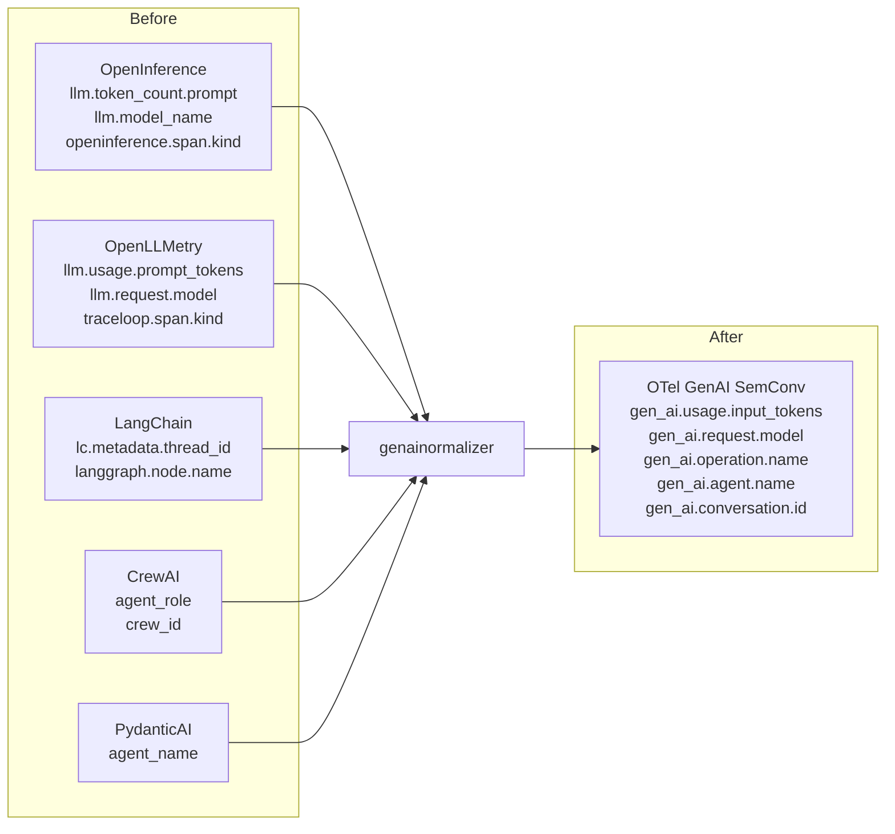

# genainormalizer

OpenTelemetry Collector processor that normalizes GenAI telemetry from [OpenInference](https://github.com/Arize-ai/openinference), [OpenLLMetry](https://github.com/traceloop/openllmetry), and framework-specific attributes to the official [OTel GenAI Semantic Conventions](https://opentelemetry.io/docs/specs/semconv/gen-ai/).

## Why

The official OTel GenAI instrumentation covers [7 libraries](https://github.com/open-telemetry/opentelemetry-python-contrib/tree/93bea2dde784/instrumentation-genai). [OpenInference](https://github.com/Arize-ai/openinference/tree/main/python/instrumentation) covers 30+ and [OpenLLMetry](https://github.com/traceloop/openllmetry/tree/main/packages) covers 30+ — each using incompatible attribute names for identical concepts. Without normalization, you can't build unified dashboards, compute per-agent metrics, or correlate logs across frameworks.



## What it does

Single-pass attribute canonicalization via configurable mapping profiles:

| Category | Example |
|----------|---------|
| Schema collision resolution | `llm.usage.prompt_tokens` (OpenLLMetry) → `gen_ai.usage.input_tokens` |
| | `llm.token_count.prompt` (OpenInference) → `gen_ai.usage.input_tokens` |
| Span kind value mapping | `openinference.span.kind: "LLM"` → `gen_ai.operation.name: "chat"` |
| Agentic abstraction unification | `agent_role` (CrewAI) → `gen_ai.agent.name` |
| Metadata promotion | `lc.metadata.thread_id` → `gen_ai.conversation.id` |

42 attribute mappings across 6 profiles: `openinference`, `openllmetry`, `langchain`, `crewai`, `pydanticai`, `strands`. All targets verified against the [OTel GenAI SemConv registry](https://opentelemetry.io/docs/specs/semconv/registry/attributes/gen-ai/) (v1.39.0).

## Configuration

```yaml
processors:
  genainormalizer:
    profiles: [openinference, openllmetry, langchain, crewai, pydanticai, strands]
    remove_originals: true  # set false to keep both original and normalized attributes

service:
  pipelines:
    traces:
      receivers: [otlp]
      processors: [genainormalizer, batch]
      exporters: [otlp/backend]
```

## Building

Build a custom collector using [OCB](https://opentelemetry.io/docs/collector/custom-collector/):

```bash
go install go.opentelemetry.io/collector/cmd/builder@latest
builder --config builder-config.yaml
./dist/otelcol-genai --config collector-config.yaml
```

## Testing

10 real agent test scenarios included in `test-agents/`:

| Framework | OpenInference | OpenLLMetry | Native OTel |
|-----------|:---:|:---:|:---:|
| Strands | ✅ | ✅ | |
| LangChain | ✅ | ✅ | |
| LangGraph | ✅ | ✅ | |
| CrewAI | ✅ | ✅ | |
| PydanticAI | ✅ | | |
| Anthropic SDK | | | ✅ |

```bash
# Run all scenarios (requires AWS credentials for Bedrock)
./test-agents/run-all.sh
```

Unit tests:

```bash
go test ./...
```

## Status

Development — working toward [donation to opentelemetry-collector-contrib](https://github.com/open-telemetry/opentelemetry-collector-contrib).
